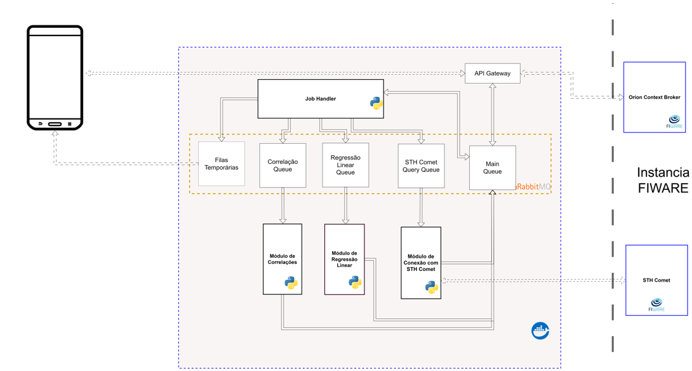

# TCC_AI_FIWARE

AI component to FIWARE environment


## Project Architecture




### Environment variables

```
    INTERNAL_RABBIT_MQ_HOST = "localhost"
    INTERNAL_RABBIT_MQ_PORT = 5672


    STH_COMET_HOST = "localhost"
    STH_COMET_PORT = 8666

    ORION_CONTEXT_BROKER_HOST = "localhost"
    ORION_CONTEXT_BROKER_PORT = 1026

```

