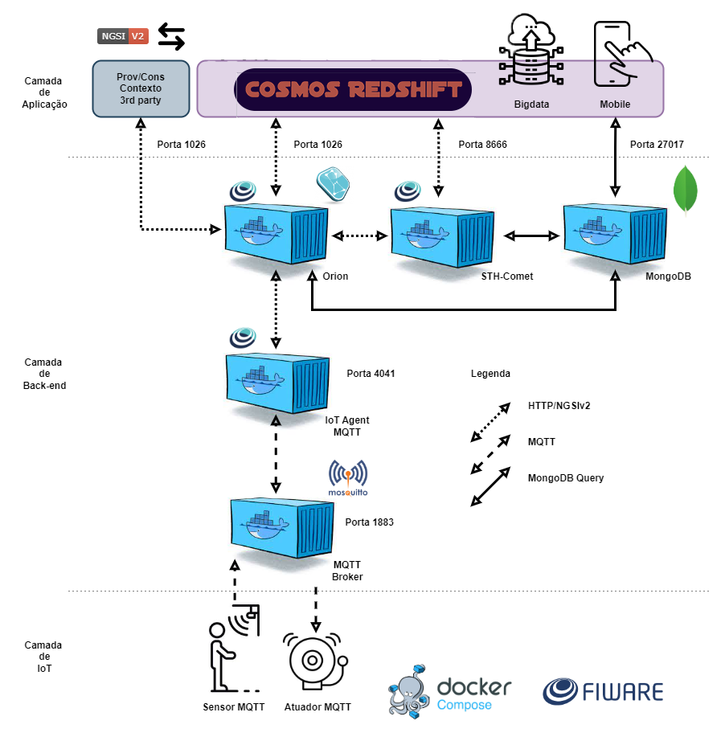

# TCC_AI_FIWARE

AI component to FIWARE environment

*******
# Table of contents

[Requirements](#requirements)
[Running on docker-compose](#running-on-docker-compose)
[API](#api)
- [Requesting sync analysis](#requesting-sync-analysis)
    - [Payload description](#payload-description)
- [Requesting Asynchronous analysis](#requesting-asynchronous-analysis)
[Project Architecture](#project-architecture)
[Tutorials](#tutorials)
[Environment variables](#environment-variables)
*******

## Requirements

To execute this project you need to have a fiware cluster with Orion Context Broker and the STH Comet component

## Running on docker-compose


```
    docker-compose up

```

## API

Users can interacte with this component by REST API, you can check all the samples shown here clicking in this [collection]()

### Requesting sync analysis

To peform a syncronized analisys, you need to execute a POST request to **/api/sync/requestAnalysis** with body as the sample bellow.


#### Payload description

* **Action:** Action to be executed, accepted values are: (CORRELATION_ANALYSIS, LINEAR_REGRESSION_ANALYSIS, 2D_GRAPHICS)
* **Entity:** Entity ID to perform analysis
* **Entity Type:** ID to entity type
* **Fields:** Entity's selected fields to perform analysis

### Requesting Asynchronous analysis

To peform this kind of request, you need to execute a POST request to **/api/requestAnalysis** using the same payload as the previos [request](#requesting-sync-analisys)

## Architectures

### Component Architetuctre


### Connection With Fiware Project



## Tutorials

### Setting fiware instance to be attached


### 1 - Discover available entities and its attributes to perform analysis

Before start requesting advanced analysis, it's recommed to read all entities and attributes available on attached fiware instance. You can check all entities by a simple GET request to **/api/availableEntities**. The image bellow demonstrate a example.

**INSERT IMG**

### 2 - Request a 2D graph


### 3 - Peform a Correlation analysis


### 4 - Peform a Linear Regression


### Environment variables

```
    INTERNAL_RABBIT_MQ_HOST = "localhost"
    INTERNAL_RABBIT_MQ_PORT = 5672


    STH_COMET_HOST = "localhost"
    STH_COMET_PORT = 8666

    ORION_CONTEXT_BROKER_HOST = "localhost"
    ORION_CONTEXT_BROKER_PORT = 1026

    FIWARE_SERVICE=smart
    FIWARE_SERVICE_PATH=/

```
