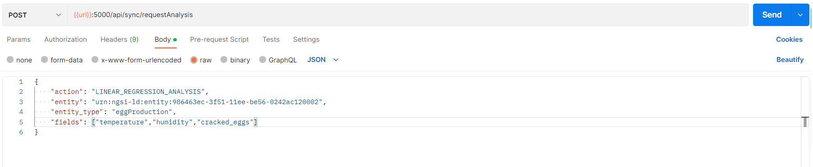

# Cosmos-Redshift

ML and data analytics Generic Enabler for FIWARE

*******
# Table of contents

[Requirements](#requirements)
[Running on docker-compose](#running-on-docker-compose)
[API](#api)
- [Requesting sync analysis](#requesting-sync-analysis)
    - [Payload description](#payload-description)
- [Requesting Asynchronous analysis](#requesting-asynchronous-analysis)
[Architectures](#architectures)
- [Component Architetuctre](#component-architetuctre)
- [Connection With Fiware Project](#connection-with-fiware-project)
[Tutorials](#tutorials)
-   [1 - Setting fiware instance to be attached](#1---setting-fiware-instance-to-be-attached)
- [2 - Discover available entities and its attributes to perform analysis](#2---discover-available-entities-and-its-attributes-to-perform-analysis)
- [3 - Request a 2D graph - Blocking](#3---request-a-2d-graph---blocking)
- [4 - Peform a Correlation analysis - Blocking](#4---peform-a-correlation-analysis---blocking)
- [5 - Peform a Linear Regression - Blocking](#5---peform-a-linear-regression---blocking)

[Environment variables](#environment-variables)
*******

## Requirements

To execute this project you need to have a fiware cluster with Orion Context Broker and the STH Comet component

## Running on docker-compose


```
    docker-compose up

```

## API

Users can interacte with this component by REST API, you can check all the samples shown here clicking in this [collection]()

### Requesting sync analysis

To peform a syncronized analisys, you need to execute a POST request to **/api/sync/requestAnalysis** with body as the sample bellow.


#### Payload description

* **Action:** Action to be executed, accepted values are: (CORRELATION_ANALYSIS, LINEAR_REGRESSION_ANALYSIS, 2D_GRAPHICS);
* **Entity:** Entity ID to perform analysis;
* **Entity Type:** ID to entity type;
* **Fields:** Entity's selected fields to perform analysis **(In LINEAR_REGRESSION_ANALYSIS, the last field will consider as target of prediction)**;
* **Agg_method** Object of aggregation method to query data, if nothing were provided, the default value is LastN=100 **(lastN,dateFrom,dateTo)**;

### Requesting Asynchronous analysis

To peform this kind of request, you need to execute a POST request to **/api/requestAnalysis** using the same payload as the previos [request](#requesting-sync-analisys)

## Architectures

### Component Architetuctre


### Connection With Fiware Project


## Tutorials

### 1 - Setting fiware instance to be attached

As mentioned on the project description, this is fiware component, therefore, it's necessary to set up the fiware instance location (STH Comet and Orion Context Broker) also the fiware service and the service path.

All of the params are available as [Environment Variables](#environment-variables), it's only necessary to set up the [Docker Compose File](./docker-compose.yml). The block bellow shows a example how docker compose file should be setted, considering that there is a fiware instance running on "*172.26.64.1*", having "*smart*" as service name and "*/*" as service path.

```
   version: '3'
    services:

    rabbitmq:
        image: "rabbitmq:3-management"
        #hostname: rabbitmq
        ports:
        - "5672:5672"  
        - "15672:15672"
    
    app:
        build:
        context: .  
        ports:
        - "5000:5000" 
        depends_on:
        - rabbitmq
        environment:
        - INTERNAL_RABBIT_MQ_HOST=rabbitmq
        - INTERNAL_RABBIT_MQ_PORT=5672
        - STH_COMET_HOST=172.26.64.1
        - STH_COMET_PORT=8666
        - ORION_CONTEXT_BROKER_HOST=172.26.64.1
        - ORION_CONTEXT_BROKER_PORT=1026
        - FIWARE_SERVICE=smart
        - FIWARE_SERVICE_PATH=/
 

```

With docker-compose.yml setted, [Execute Docker Container](#running-on-docker-compose)

### 2 - Discover available entities and its attributes to perform analysis

Firstly, make sure to set correctly all [Envirorment Variables](#environment-variables).

Before start requesting advanced analysis, it's recommed to read all entities and attributes available on attached fiware instance. You can check all entities by a simple GET request to **/api/availableEntities**. The image bellow demonstrate a example.


As demonstrated above, the example fiware instance has a Entity type called "eggPrediction" with id "urn:ngsi-ld:entity:986463ec-3f51-11ee-be56-0242ac120002" and attributes: "cracked_eggs", "dateReading" and "humidity".


### 3 - Request a 2D graph - Blocking

To peform a 2D Graph request, you have to execute a POST request to **/api/sync/requestAnalysis** using action field as "2D_GRAPHIC" as shown bellow.

Please, pay attention that we have use **entity** with the same value of **id** got from the [previous sample](#2---discover-available-entities-and-its-attributes-to-perform-analysis) and **entity_type** as the same of collected on [previous sample](#2---discover-available-entities-and-its-attributes-to-perform-analysis)


In this case, you should receive a anwser like that


Attribute **img** is the result of analisys formatted as png image and enconded by BASE64 method. You can use the [Base64 Guru Site](https://base64.guru/converter/decode/image) to convert raw data in image. Keeping the last example, we got the image bellow.

### 4 - Peform a Correlation analysis - Blocking

Continuing with the same fiware instance, let's request a correlation analysis with attributes "cracked_eggs" and "temperature". Again, create a POST request, but now change the payload as demonstrate bellow.


The component should return a message like that.


Attribute **img** is the result of analisys formatted as png image and enconded by BASE64 method. You can use the [Base64 Guru Site](https://base64.guru/converter/decode/image) to convert raw data in image. Keeping the last example, we got the image bellow.


### 5 - Peform a Linear Regression - Blocking

Continuing with the same fiware instance, let's request a linear analysis with attributes  "humidity" ,"temperature" and "cracked_eggs" as **Target**. Again, create a POST request, but now change the payload as demonstrate bellow.



The component should return a message like that.


In this case, The parameters of linear regression is returned (coefficients and intercept), also a graph indicating the model prevision versus the real value mensured

### Environment variables

```
    INTERNAL_RABBIT_MQ_HOST = "localhost"
    INTERNAL_RABBIT_MQ_PORT = 5672


    STH_COMET_HOST = "localhost"
    STH_COMET_PORT = 8666

    ORION_CONTEXT_BROKER_HOST = "localhost"
    ORION_CONTEXT_BROKER_PORT = 1026

    FIWARE_SERVICE=smart
    FIWARE_SERVICE_PATH=/

```
